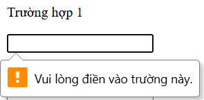
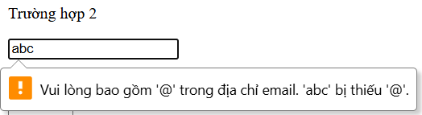
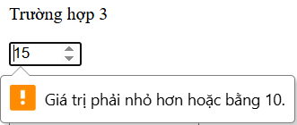
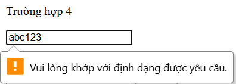
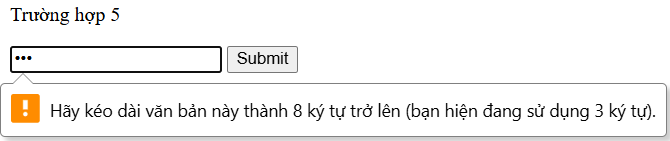

**Câu A1 — Input Types**
1. type="text" -> Ô nhập text thường, tự kiểm tra qua minlength, maxlength và pattern. -> Dùng cho form nhập họ và tên.
2. type="email" -> Ô nhập text, tự động kiểm tra định dạng phải có ký tự @. -> Dùng cho nhập email liên hệ.
3. type="password" -> Ô nhập text bị ẩn ký tự, tự kiểm tra qua minlength và pattern. -> Dùng cho nhập mật khẩu đăng nhập.
4. type="number" -> Ô nhập số có nút tăng/giảm, tự kiểm tra bằng min, max, step. -> Dùng cho chọn số lượng sản phẩm thêm vào giỏ.
5. type="tel" -> Hiển thị bàn phím số (trên mobile), tự kiểm tra qua pattern. -> Dùng cho nhập số điện thoại giao hàng.
6. type="date" -> Hiển thị Date picker (Lịch), tự kiểm tra giới hạn min, max. -> Dùng cho chọn ngày giao hàng hoặc ngày sinh.
7. type="color" -> Hiển thị Color picker, không có tự động validate. -> Dùng cho việc custom màu sắc sản phẩm (VD: in áo).
8. type="range" -> Hiển thị thanh trượt (Slider), tự kiểm tra qua min, max, step. -> Dùng để người dùng kéo chọn mức giá tiền (Filter).
9. type="file" -> Nút bấm chọn file, tự kiểm tra định dạng qua accept hoặc số lượng qua multiple. -> Dùng để upload ảnh đánh giá sản phẩm.
10. type="url" -> Ô nhập text, tự kiểm tra định dạng phải có http:// hoặc https://. -> Dùng để người dùng dán link trang cá nhân facebook.  

Tài liệu tham chiếu: tuan_1_html5/07_forms_interactive.md -> Các Input Types HTML5

**Câu A2 — Validation Attributes**
1. Dự đoán
- Trường hợp 1 (required): Trình duyệt chặn Submit, báo lỗi yêu cầu điền vào ô này. Giải thích: Do thuộc tính required bắt buộc người dùng không được để trống.

- Trường hợp 2 (type="email"): Trình duyệt chặn Submit, báo lỗi thiếu dấu @. Giải thích: type="email" được tích hợp sẵn khả năng kiểm tra format bắt buộc của một email.

- Trường hợp 3 (max="10"): Trình duyệt chặn Submit, báo lỗi giá trị phải nhỏ hơn hoặc bằng 10. Giải thích: Giá trị 15 đã vượt quá thuộc tính max="10".

- Trường hợp 4 (pattern="[0-9]{10}"): Trình duyệt chặn Submit, báo dữ liệu không khớp định dạng. Giải thích: Regex yêu cầu bắt buộc phải là 10 chữ số, trong khi chuỗi "abc123" chứa chữ cái và không đủ độ dài.

- Trường hợp 5 (minlength="8"): Trình duyệt chặn Submit. Giải thích: Thuộc tính minlength="8" yêu cầu tối thiểu phải có 8 ký tự, chuỗi "123" quá ngắn.  
2. Kết quả validation thực tế:
- Trường hợp 1:
- Trường hợp 2:
- Trường hợp 3:
- Trường hợp 4:
- Trường hợp 5:  

Tài liệu tham chiếu: tuan_1_html5/07_forms_interactive.md -> HTML5 Validation Attributes

**Câu A3 - Acessibility**
1. Thẻ `<label for="email">` rất quan trọng vì nó giúp người dùng dùng screen reader (trình đọc màn hình) hiểu được ô nhập liệu đó dùng để làm gì.

2. 
- `<fieldset>` và `<legend>` được dùng để gom nhóm các thông tin liên quan với nhau. 
- Ví dụ: Nhóm phần "Thông tin giao hàng" bao gồm các ô Địa chỉ, Thành phố và Số điện thoại.

3. 
- aria-label dùng để mô tả chức năng cho những thành phần chỉ có icon mà không có chữ đi kèm (Ví dụ: Nút có icon giỏ hàng). 
- Không nên dùng aria-label khi đã có thẻ `<label>` vì nó gây lặp thông tin và dư thừa đối với screen reader.  

Tài liệu tham chiếu: tuan_1_html5/07_forms_interactive.md -> Accessibility — Form cho mọi người

**Câu A4 — Media**  
1. 
- Thuộc tính loading="lazy" giúp trì hoãn việc tải hình ảnh cho đến khi người dùng cuộn màn hình đến vị trí của nó. 
- Không nên dùng thuộc tính này cho các ảnh hiển thị ngay ở đầu trang (above-the-fold) vì nó sẽ làm chậm trải nghiệm ban đầu của người dùng.

2. 
- Nên cung cấp nhiều `<source>` cho thẻ `<video>` để đề phòng trường hợp trình duyệt của người dùng không hỗ trợ đọc định dạng file đó, nó sẽ tự chuyển qua tải định dạng khác. 
- 3 format phổ biến: MP4, WebM, Ogg.
3. 
- Thuộc tính alt dùng để mô tả văn bản thay thế nếu ảnh bị lỗi, và dùng cho screen reader đọc cho người khiếm thị.
- alt tốt cho 3 trường hợp:  
    + iPhone 16: alt="Điện thoại iPhone 16 Pro Max 256GB màu Đen"

    + Ảnh trang trí: alt="" (Để trống để trình đọc màn hình bỏ qua)

    + Ảnh biểu đồ: alt="Biểu đồ cột mô tả doanh thu Quý 1 năm 2026 đạt 50 tỷ đồng"  

**Câu A5 — So sánh `<figure>` vs ``**
- Dùng Cách 1 (``): Áp dụng cho các ảnh mang tính minh họa đơn thuần, không cần phải có dòng chú thích mô tả đi kèm. (Ví dụ: Ảnh Avatar user, ảnh Icon danh mục).

- Dùng Cách 2 (`<figure>`): Áp dụng khi nội dung hình ảnh đó có ý nghĩa độc lập và cần một dòng chú thích (caption) đính kèm để giải thích cho người đọc. (Ví dụ: Ảnh sản phẩm kèm tên/giá tiền, Ảnh một biểu đồ thống kê kỹ thuật).  

**Bài B1 — Form Đăng ký Tài khoản**  
Lí do mà HTML không thể tự validate "Xác nhận password" có khớp với "Password" hay không là vì HTML5 validation chỉ hoạt động độc lập trên từng thẻ `<input>` dựa vào các rules có sẵn (pattern, min, max). HTML không có khả năng tham chiếu và so sánh giá trị chéo giữa hai ô input khác nhau. Việc này bắt buộc phải dùng JavaScript để lấy value của 2 ô ra và so sánh.

**Câu C1 — Debug Form**
1. Lỗi 1: Dòng 2 — Input "Tên" không có `<label for="...">`, vi phạm accessibility.   
Sửa:  
`<label for="name">Tên:</label>`  
`<input type="text" id="name" name="name">`
2. Lỗi 2: Dòng 4 — Input email thiếu `<label for="...">`.  
Sửa:  
`<label for="email">Email:</label> `  
`<input type="email" id="email" placeholder="Email của bạn">`
3. Lỗi 3: Dòng 6 — Input password thiếu `<label for="...">`.  
Sửa:  
`<label for="password">Mật khẩu:</label>`  
`<input type="password" id="password" placeholder="Mật khẩu">`
4. Lỗi 4: Dòng 7 — Input nhập lại mật khẩu thiếu `<label for="...">`.  
Sửa:  
`<label for="re-password">Nhập lại mật khẩu:</label>`  
`<input type="password" id="re-password" placeholder="Nhập lại mật khẩu">`
5. Lỗi 5: Dòng 9 — Số điện thoại dùng sai type (nên dùng type="tel") và thiếu `<label>`.
Sửa:  
`<label for="phone">Phone:</label>`  
`<input type="tel" id="phone" name="phone" value="0901234567">`
6. Lỗi 6: Dòng 11 — Thẻ `<select>` thiếu `<label for="...">`, thiếu thuộc tính id và name.  
Sửa:  
`<label for="city">Thành phố:</label>`  
`<select id="city" name="city">`
7. Lỗi 7: Dòng 12, 13 — Các thẻ `<option>` không có thuộc tính value để gửi dữ liệu.  
Sửa:  
`<option value="hanoi">Hà Nội</option>`
8. Lỗi 8: Dòng 16 — Đồng ý điều khoản nhưng thiếu ô đánh dấu (checkbox) bên trong thẻ label.  
Sửa:  
`<label><input type="checkbox" name="agree" required> Tôi đồng ý điều khoản</label>`

**Câu C2 — Thiết kế chiến lược Validation**  
1. Pattern Regex:
- CMND/CCCD: pattern="[0-9]{12}"
- Số tài khoản: pattern="[0-9]{10,15}"
2. 
- HTML5 Validation là KHÔNG đủ an toàn cho ứng dụng ngân hàng. 
- Validation của HTML chỉ chạy ở mặt Frontend (phía trình duyệt). Người dùng hoặc Hacker có thể dễ dàng dùng Developer Tools xóa bỏ các thuộc tính như required, pattern, minlength để gửi mã độc về phía Server.
3. 3 loại validation HTML5 KHÔNG THỂ làm được:
- Kiểm tra trùng khớp mật khẩu (Password và Confirm Password).
- Kiểm tra xem Email hoặc Username đã tồn tại trong Database hay chưa (Phải gọi API).
- Kiểm tra các logic nghiệp vụ (Ví dụ: Ngày kết thúc phải lớn hơn ngày bắt đầu, hoặc thuật toán checksum của thẻ tín dụng).
4. 2 rủi ro bảo mật nếu chỉ validate trên Frontend:
- Hacker chèn mã độc thực thi cơ sở dữ liệu (SQL Injection) gây sập hệ thống.
- Gửi dữ liệu rác, phá hỏng logic nghiệp vụ hệ thống (Ví dụ: Gửi số tiền giao dịch là số âm).