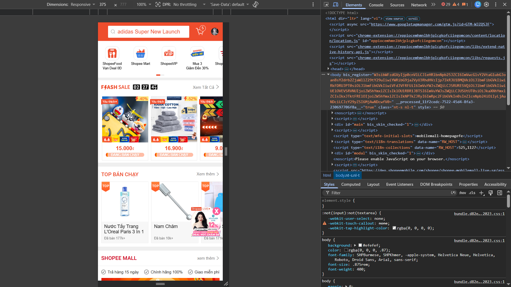
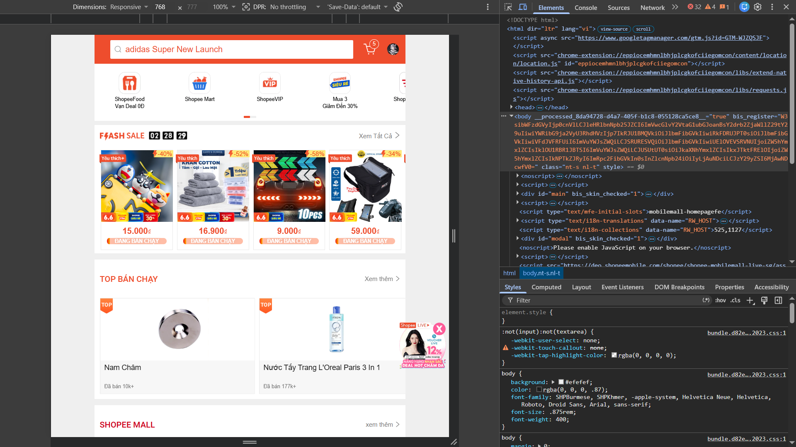
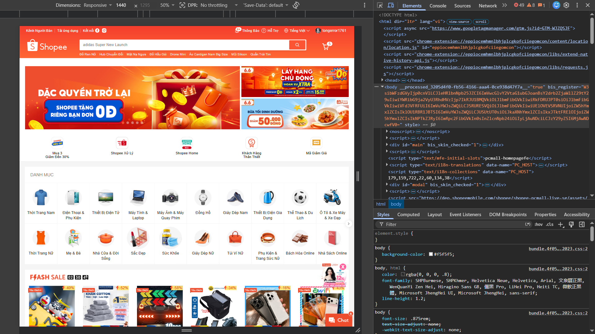
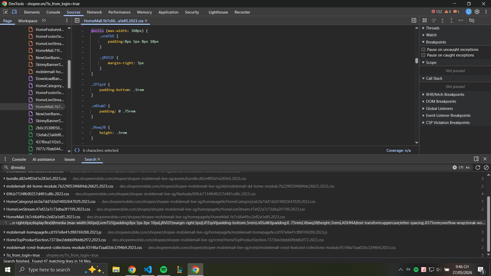
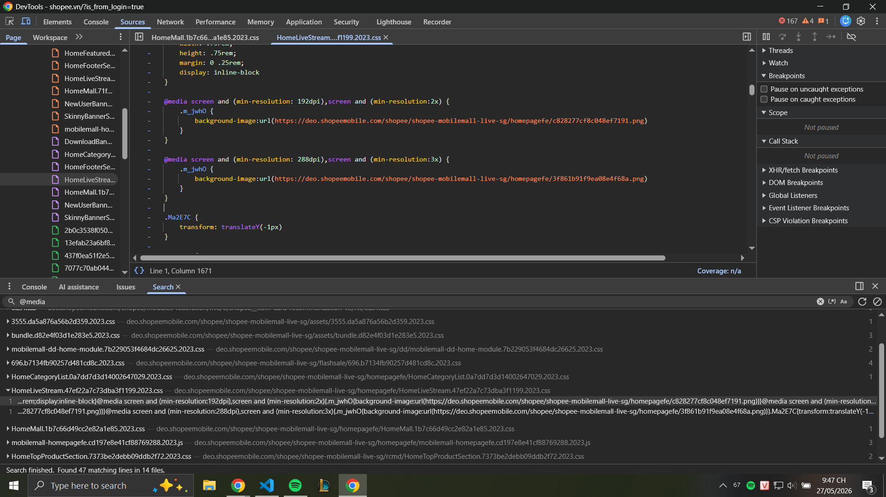

### PHẦN A — KIỂM TRA ĐỌC HIỂU ###  
## Câu A1 (Viewport & Mobile-First)
1. Thẻ meta: `<meta name="viewport" content="width=device-width, initial-scale=1.0">`.
    - width=device-width: Đặt chiều rộng trang bằng chiều rộng của thiết bị.
    - initial-scale=1.0: Mức zoom mặc định là 100%.
2. Nếu thiếu: iPhone sẽ coi trang web là bản Desktop và thu nhỏ lại, dẫn đến chữ siêu nhỏ, người dùng phải zoom bằng tay để đọc.
3. Mobile-First vs Desktop-First:
    - Mobile-First: Code mặc định cho mobile, dùng min-width để mở rộng cho màn hình lớn hơn. Khuyên dùng vì hiệu năng tốt hơn, UX đúng thực tế, code sạch hơn và chuẩn hiện đại.
    - Code:
    ```text
    /* Mobile (mặc định) */
    .container {
        padding: 10px;
    }
    /* Tablet trở lên */
    @media (min-width: 768px) {
        .container {
            padding: 30px;
        }
    }
    ```
    - Desktop-First: Code mặc định cho desktop, dùng max-width để thu nhỏ.
    - Code:
    ```text
    /* Desktop (mặc định) */
    .container {
        padding: 30px;
    }
    /* Mobile */
    @media (max-width: 768px) {
        .container {
            padding: 10px;
        }
    }
    ```
## Câu A2 (Breakpoints)
Theo tài liệu tham chiếu: tuan_3_css_advanced/13_creating_responsive_layouts.md → 16_sass_scss.md:
- xs (< 576px): Mobile dọc (1 cột).
- sm (≥ 576px): Mobile ngang (1 cột).
- md (≥ 768px): Tablet (2 cột).
- lg (≥ 992px): Desktop nhỏ (3-4 cột).
- xl (≥ 1200px): Desktop lớn (4-6 cột).
## Câu A3 (Media Queries)
| Chiều rộng màn hình | `.container` width |
|----------|---------------------------|
| 375px (iPhone SE) | 100% |
| 600px | 540px |
| 800px | 720px |
| 1000px | 960px |
| 1400px | 1140px |
## Câu A4 (SCSS Basics)
1. Variables: Dùng để lưu trữ màu, font, kích thước, tái sử dụng khắp nơi ($primary: #333).
2. Nesting: Viết CSS lồng nhau giúp cấu trúc mã giống HTML, dễ đọc.
3. Mixins: Gom các nhóm thuộc tính CSS để dùng lại (@mixin flex-center {...}).
4. Extend: Cho phép selector này thừa kế thuộc tính từ selector khác.
- Tại sao trình duyệt không đọc được SCSS: Trình duyệt chỉ hiểu CSS. Cần dùng trình biên dịch (Sass compiler) để chuyển file `.scss` sang `.css`.
### PHẦN B — THỰC HÀNH CODE ###
## Bài B3 (SCSS Refactor)
**Lệnh biên dịch SCSS sang CSS:**

Sử dụng công cụ Sass qua giao diện dòng lệnh (Terminal). Mở terminal tại thư mục chứa dự án và chạy:

```bash
sass scss/style.scss style.css
```
### PHẦN C — PHÂN TÍCH ###
## Câu C1
1. 
- Mobile (375px):

- Tablet (768px):

- Desktop (1440px):

2. 
- Navigation thay đổi như thế nào?
    + Trên Desktop (1440px): Header rất to và đầy đủ. Dòng trên cùng chứa hàng loạt các liên kết tiện ích (Kênh Người Bán, Tải ứng dụng, Thông báo, Đăng ký/Đăng nhập). Dòng dưới là Logo lớn, thanh tìm kiếm (Search bar) rất dài và icon Giỏ hàng.
    + Trên Tablet (768px): Header bắt đầu thu gọn lại. Dòng liên kết tiện ích phía trên cùng có thể bị ẩn đi một vài mục ít quan trọng. Thanh tìm kiếm bị thu ngắn lại để vừa với kích thước màn hình.
    + Trên Mobile (375px): Thanh điều hướng thay đổi hoàn toàn để tối ưu cho cảm ứng. Các liên kết text (Đăng nhập, Đăng ký, Kênh người bán) bị ẩn hoàn toàn. Header giờ đây được ghim cố định (Sticky) ở trên cùng, chỉ chừa lại đúng Thanh tìm kiếm, icon Giỏ hàng và icon Chat. Thường sẽ xuất hiện thêm thanh điều hướng dưới đáy (Bottom Navigation) chứa các tab chính (Trang chủ, Mall, Video, Tôi).
- Lưới content thay đổi mấy cột?
    + Desktop: Lưới sản phẩm (Ví dụ: mục "Gợi ý hôm nay") dàn trải cực kỳ rộng, thường hiển thị 6 cột sản phẩm. Các banner quảng cáo và danh mục cũng chiếm không gian rất lớn.
    + Tablet: Lưới sản phẩm co lại, thường hiển thị khoảng 4 cột để hình ảnh không bị quá bé.
    + Mobile: Lưới sản phẩm chuyển về chuẩn 2 cột. Đây là tỷ lệ vàng của E-commerce trên mobile, giúp thẻ sản phẩm (Card) đủ to để thấy rõ ảnh, tên và giá tiền, nhưng vẫn tiết kiệm được không gian cuộn chuột. Các danh mục (Categories) thường chuyển sang dạng vuốt ngang (Horizontal Scroll).
- Elements nào bị ẩn trên mobile?
    + Top Navigation Links: Toàn bộ các menu chữ ở góc trên cùng bên phải và trái (Tải ứng dụng, Kết nối Facebook, Hỗ trợ...) bị gỡ bỏ để Header gọn gàng.
    + Sidebar Bộ lọc (Filter): (Nếu ở trang tìm kiếm) Bộ lọc bên trái màn hình Desktop sẽ bị ẩn đi, thay thế bằng một nút "Lọc" nhỏ. Khi bấm vào, menu lọc mới trượt từ cạnh màn hình ra (Off-canvas menu).
    + Các Banner phụ: Các banner quảng cáo dọc hai bên hoặc các khoảng trắng dư thừa bị loại bỏ hoàn toàn.
- Font size có thay đổi không?  
    + Có sự điều chỉnh rõ rệt. Trên Mobile, font chữ của tiêu đề sản phẩm bị thu nhỏ lại và bị giới hạn số dòng (hiện dấu ... sớm hơn) để card sản phẩm không bị quá dài. Tuy nhiên, font chữ của Giá tiền (màu cam/đỏ) vẫn được giữ kích thước lớn và in đậm để thu hút sự chú ý. Các nút bấm (như nút "Mua") được làm to ra để ngón tay dễ chạm trúng (Touch targets).
3. 2 media queries shopee.vn dùng:


## Câu C2 (Thiết kế Responsive Strategy)
1. Mobile:
```
┌─────────────────────────┐
│  [🍽 LOGO]              │  ← SĐT bị ẨN (display:none)
├─────────────────────────┤
│     HERO IMAGE          │  ← full width
│  (overlay text ngắn)    │
├─────────────────────────┤
│   ẢNH MÓN ĂN — 2 cột    │
│  [📷1][📷2]            │
│  [📷3][📷4]            │  ← Grid 2×3
│  [📷5][📷6]            │
├─────────────────────────┤
│   FORM ĐẶT BÀN          │
│  [📅 Ngày          ]    │
│  [🕐 Giờ][👥 Người]    │  ← stacked, fullwidth
│  [📝 Ghi chú       ]    │
│  [  ĐẶT BÀN NGAY  ]     │
├─────────────────────────┤
│  🗺 Google Maps         │  ← sau form, 100% width
│  (height: 200px)        │
├─────────────────────────┤
│        FOOTER           │
└─────────────────────────┘
```
+ Những gì bị ẩn? -> SĐT trên header (display: none). Có thể ẩn thêm sidebar (nếu có), footer links phụ.
+ Form nằm đâu? -> Ngay sau grid ảnh, chiếm 100% width, các trường xếp dọc (stacked).
2. Tablet:
```
┌──────────────────────────────────────┐
│  [🍽 LOGO]          📞 xxxx xxx xxx  │  ← SĐT hiện lại
├──────────────────────────────────────┤
│                                      │
│             HERO IMAGE               │  ← full width
│                                      │
├──────────────────────────────────────┤
│  ẢNH MÓN ĂN — 3 cột                  │
│  [📷1]        [📷2]       [📷3]     │  ← Grid 3×2
│  [📷4]        [📷5]       [📷6]     │
├───────────────────┬──────────────────┤
│   FORM ĐẶT BÀN    │  🗺 Google Maps  │
│  [📅][🕐]        │                  │
│  [👥 Số người]   │   (height 100%   │  ← Form + Map cạnh nhau
│  [📝 Ghi chú ]   │    của form)     │
│  [ ĐẶT BÀN ]      │                  │
├───────────────────┴──────────────────┤
│               FOOTER                 │
└──────────────────────────────────────┘
```
+ Grid ảnh mấy cột? -> 3 cột (grid-template-columns: repeat(3, 1fr)), 6 ảnh thành 2 hàng.
+ Bản đồ nằm đâu? -> Cạnh bên phải của form, chiếm 50% width (grid: 1fr 1fr), cùng hàng.
3. Desktop
```
┌────────────────────────────────────────────────────────┐
│  [🍽 NHÀ HÀNG LOGO]            📞 0901 234 567         │
├────────────────────────────────────────────────────────┤
│                                                        │
│                HERO IMAGE (full width)                 │
│                                                        │
├────────────────────────────────────────────────────────┤
│  ẢNH MÓN ĂN — 6 cột (1 hàng duy nhất)                  │
│  [📷1] [📷2] [📷3] [📷4] [📷5] [📷6]                │
├─────────────────────────────────┬──────────────────────┤
│  FORM ĐẶT BÀN  (8/12 cột)       │  SIDEBAR (4/12 cột)  │
│  [📅 Ngày][🕐 Giờ][👥 Người]   │  ⏰ Giờ mở cửa      │
│  [📝 Ghi chú]                   │  📍 Địa chỉ          │
│  [    ĐẶT BÀN NGAY →    ]       │  🌟 Đánh giá         │
├─────────────────────────────────│  🎁 Khuyến mãi       │
│  🗺 Google Maps (8/12 cột)      │                      │
│                                 │                      │
├─────────────────────────────────┴──────────────────────┤
│   FOOTER: [Về chúng tôi] [Menu] [Liên hệ & MXH]        │
└────────────────────────────────────────────────────────┘
```
- Layout bao nhiêu cột? -> 12 cột CSS Grid. Content chiếm 8 cột (col-span: 8), Sidebar chiếm 4 cột (col-span: 4).
- Sidebar có không? -> Có. Sidebar hiển thị thông tin bổ sung: giờ mở cửa, địa chỉ, đánh giá, khuyến mãi. Ở mobile/tablet sidebar bị ẩn hoặc gộp vào footer.
- CSS skeleton:
```
.layout-container {
    display: grid;
    grid-template-columns: 1fr;
    gap: 20px;
}

.food-grid {
    display: grid;
    grid-template-columns: 1fr;
    gap: 15px;
}

.booking-section {
    display: grid;
    grid-template-columns: 1fr;
    gap: 20px;
}

@media (min-width: 768px) {
    /* Lưới món ăn: 2 cột */
    .food-grid {
        grid-template-columns: repeat(2, 1fr);
    }

    .booking-section {
        grid-template-columns: 1fr 1fr;
    }
}

@media (min-width: 1024px) {
    .main-content-wrapper {
        display: grid;
        grid-template-columns: 2fr 1fr;
        gap: 30px;
    }

    .food-grid {
        grid-template-columns: repeat(3, 1fr);
    }

    .booking-section {
        /* Bỏ grid 2 cột của tablet, chuyển về dạng cột dọc cho sidebar */
        grid-template-columns: 1fr; 
        position: sticky;
        top: 20px;
    }
}
```